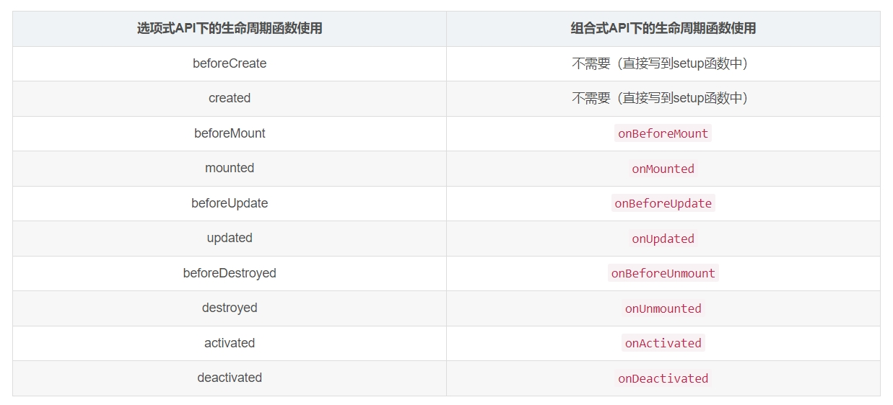
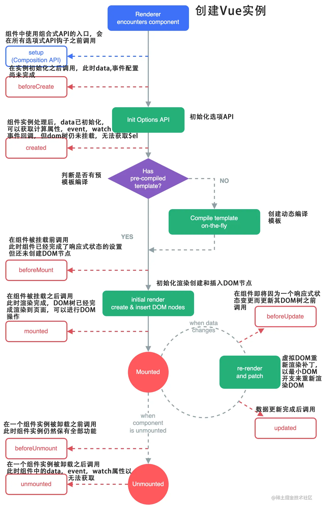

# vue3

1. 如何理解vue3官网上说明的`渐进性`？
> 简单说，就是不做多余的操作，用你目前用得上的东西，需要哪些功能就引入哪些
2. vue3的生命周期函数对比 
3. vue3生命周期图 及 父子组件挂载更新顺序
> 
> ```js
> // 组件挂载时
> // father setup
> // child setup
> // child mounted
> // father mounted
> // 子组件取消挂载后
> // father beforeUpdate
> // child beforeUnmount
> // child unmounted
> // father update
> ```
4. `props`和`data`哪个优先级高？
> 优先级 props -> methods -> data -> computed -> watch